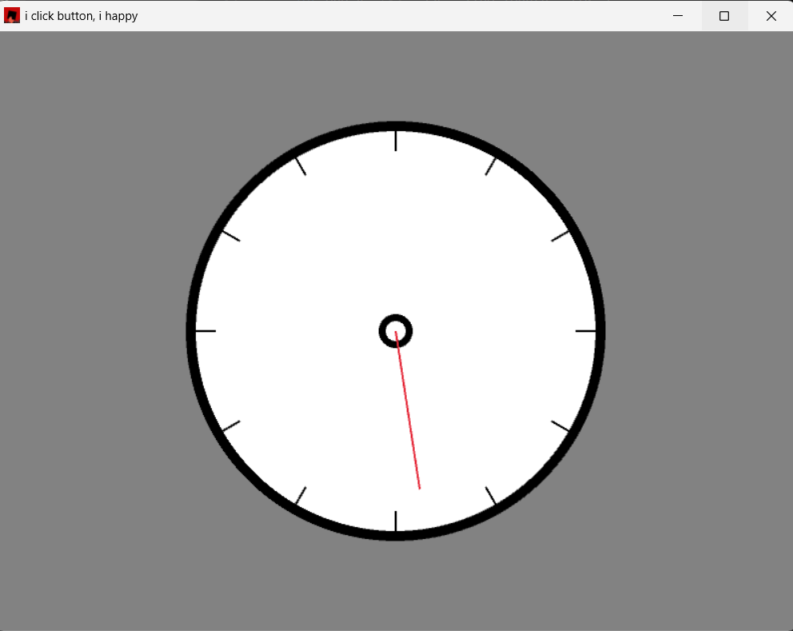

# simple_clock

[](https://opensource.org/licenses/MIT)

a little side project to revisit the basics, i want it to be polished and functional as much as my knowlage allows that. a clock as you'd expect one (analouge)


---

## Tech Stack

- Language: Rust
- Main libs/frameworks: Macroquad

---

## Features


- Smoothly moving second line
- Minute markers every 5 minutes
- Indication for if the clock is on or off and the toggle button
- Using enum for ease of adding a sync to real time later
- Reset & Sync time buttons 
- 

- something the user can interact with, even if it's just the clocks coulur (50% done, stop/start clock
- minutes indicator
- sync to real time
  

---

### Installation

```bash
# clone the repo
git clone https://github.com/CodeWithCompound/simple_clock.git
cd REPO_NAME
